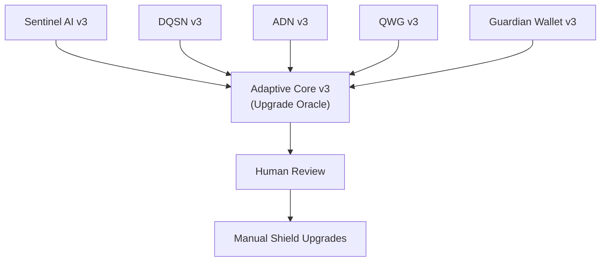

# DigiByte Adaptive Core (v3)


**Adaptive Core v3** is the **Upgrade Oracle** of the DigiByte Quantum Shield.

It is a **read-only, deterministic, fail-closed advisory system** that observes shield signals,
derives evidence and findings, and produces **human-reviewed upgrade reports**.

> Adaptive Core v3 observes, summarizes, and reports.  
> It never executes, never modifies state, and never self-upgrades.

---

## 🔐 Core Properties

- **Read-only / advisory only**
- **Deterministic & replayable**
- **Fail-closed (no silent defaults)**
- **Human-reviewed outputs**
- **No authority over keys, transactions, or nodes**
- **Aligned with Archangel Michael Guardrails**

---

## 🧩 Role in the DigiByte Quantum Shield



---

## 📦 What Adaptive Core v3 Produces

- Canonicalized observations (strict v3 schema)
- Deterministic evidence counters (hot-window)
- Deterministic findings & drift indicators
- Human-readable upgrade reports (JSON + Markdown)
- Integrity envelopes (hash + signature status)
- Privacy-preserving cross-node summaries

---

## 🚫 What Adaptive Core v3 Does NOT Do

- Execute transactions
- Modify wallet or node state
- Hold keys or secrets
- Auto-apply patches
- Guess missing data
- Perform black-box ML

---

## 📚 Documentation

All authoritative documentation lives under:

```
docs/reports/v3/
```

Key documents:

- `README.md` — v3 overview
- `INDEX.md` — documentation index
- `CONTRACT.md` — normative behavior contract
- `AUTHORITY_BOUNDARIES.md` — hard authority limits
- `GUARDRAILS.md` — enforced guardrails registry
- `SECURITY.md` — security posture & disclosure
- `REPORT_FORMAT.md` — report structure
- `PIPELINE_USAGE.md` — execution pipeline
- `NODE_SUMMARY.md` — cross-node aggregation
- `DRIFT_RADAR.md` — drift detection model
- `CORRELATION.md` — correlation logic
- `CONFIDENCE_MODEL.md` — confidence scoring
- `EVIDENCE_STORE.md` — evidence window semantics

If docs and code ever diverge, **code + CONTRACT.md wins**.

---

## 🧪 Quality & Verification

- CI enforced
- ≥90% test coverage (currently ~96%)
- Deterministic tests only
- No silent fallback paths
- All guardrails validated at runtime

---

## 🤝 Contributing

See [`CONTRIBUTING.md`](CONTRIBUTING.md).

All contributions must:
- preserve determinism
- preserve explainability
- preserve authority boundaries
- include tests

---

## 📝 License

MIT License © **DarekDGB**
