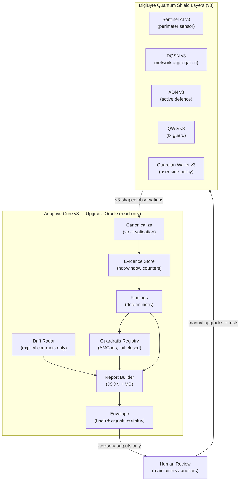
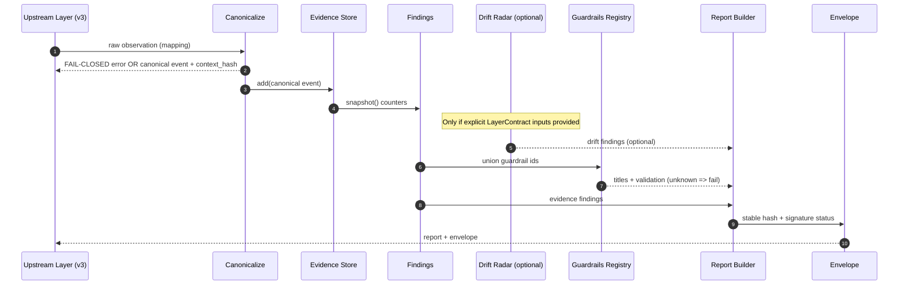
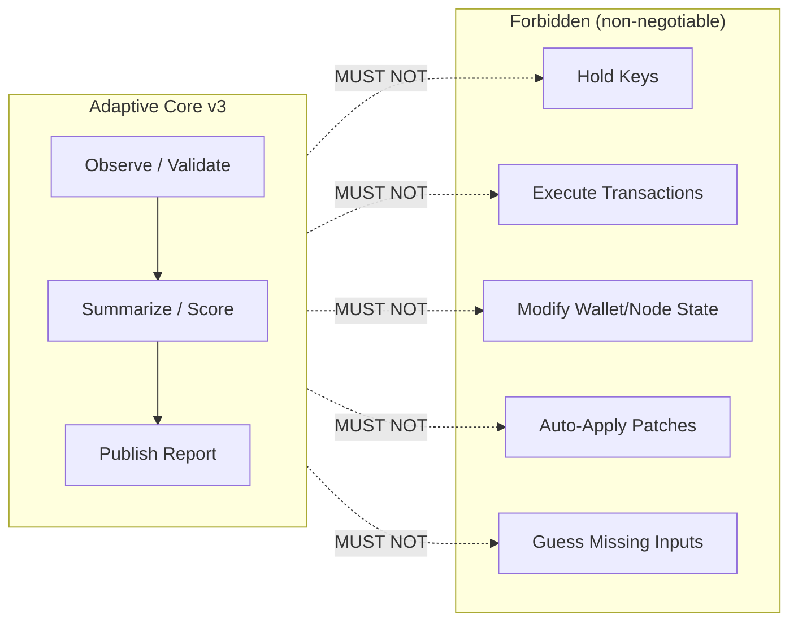
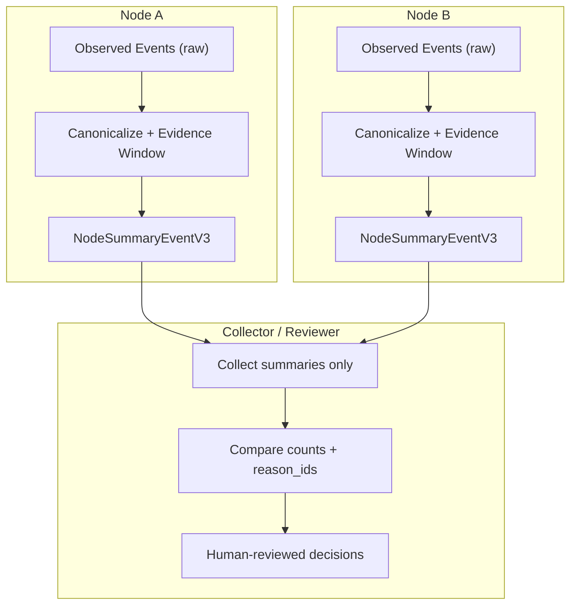

# Adaptive Core v3 — Architecture Diagram Pack

This file provides **visual architecture only** (no duplicated prose).
Authoritative behavioral rules remain in:
- AUTHORITY_BOUNDARIES.md
- CONTRACT.md
- REASON_IDS.md
- SECURITY.md

---

## 1) System Topology (v3 as Upgrade Oracle)

---

## 2) Deterministic Pipeline (single run)

---

## 3) Authority Boundary Map

---

## 4) Cross-Node Summary (privacy-preserving aggregation)

---

## Notes

- Diagrams intentionally avoid implementation detail beyond module boundaries.
- Keep aligned with adaptive_core/v3/* code paths.
- If diagrams and code disagree, **code + CONTRACT win**.
