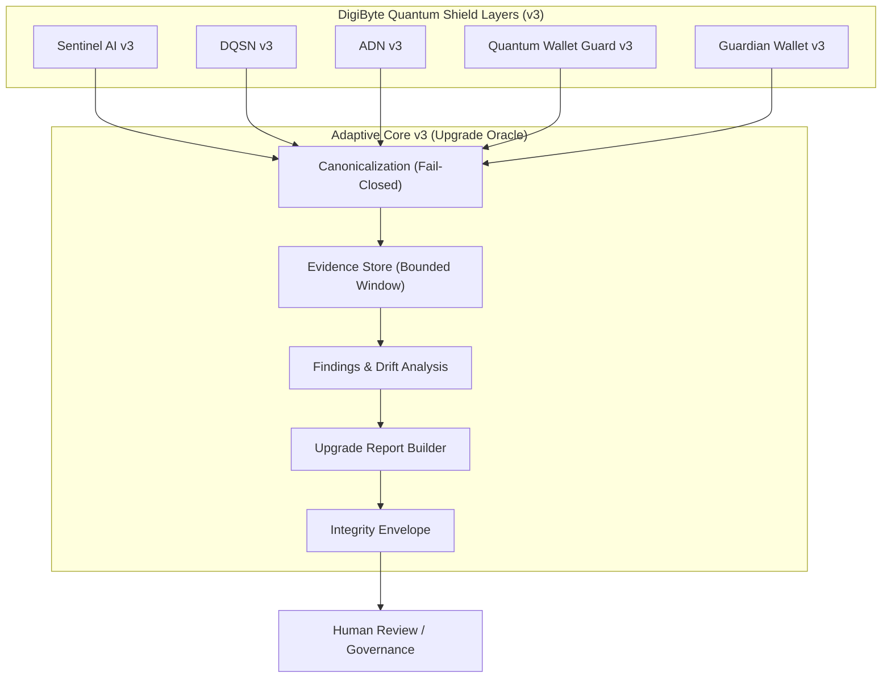

# Adaptive Core v3 — Architecture Overview

This document defines the **authoritative architecture** of Adaptive Core v3
within the DigiByte Quantum Shield.

Adaptive Core v3 is a **read-only Upgrade Oracle**.
It observes, analyzes, and reports — it never executes actions.

---

## High-Level Architecture

---

## Architectural Invariants

- **Read-only**: No component of Adaptive Core can modify shield layers
- **Deterministic**: Same inputs always produce the same report
- **Fail-closed**: Invalid or malformed input is rejected
- **No execution authority**: Reports are advisory only
- **Human-reviewed**: Final decisions are always external

---

## Explicit Non-Features

Adaptive Core v3 does **not**:
- execute transactions
- alter wallet or node state
- auto-apply upgrades
- silently accept malformed input
- influence consensus or networking logic

---

## Canonical Authority

If future documentation, diagrams, or implementations conflict
with this file, **this file is the source of truth**.
